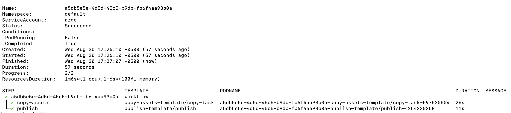

## Instructions

This task publishes the STAC items in a payload to AWS S3. It can be run after the _copy-assets_ task, for example, in order to publish the updated STAC items in the output payload from that task to S3.

The _input.json_ file contains the input payload that needs to be submitted to the _copy-assets_ task, which after it finishes running will also run the _publish_ task since both of these tasks appear under `process-tasks` in the input payload.

In order to run this task within Argo Workflows, follow the below instructions.

1. Clone this repository and `cd` into this directory.

2. Create an image from the provided Dockerfile using standard Docker commands.

3. Create an S3 bucket in your AWS account with an IAM user that has credentials to access this bucket. The IAM user credentials are needed in the next step.

4. Follow the instructions [here](https://github.com/Element84/filmdrop-k8s-helm-charts/tree/main/charts/workflow-config) to deploy all K8s components onto a cluster that are required for this workflow/task to run. Before deploying the workflow-configuration helm chart, update the `values.yaml` file for that chart to contain the base-64 encoded AWS credentials of the IAM user, and the `data_bucket` (name of the bucket where the output of the publish task will be uploaded), and then deploy the chart.

5. Change the bucket name in the `path_template` variable in `process-upload_options` within the `input.json` file to be the name of the bucket in S3 where you want the output STAC item file to be uploaded. For example, if you want to save the output file inside the `output` folder of a bucket named `publish_results` and templated by the Item's collection and id, the `path_template` would be `s3://publish_results/output/${collection}/${id}/`. Also, update the `public` property under `tasks-publish` to either true or false depending on whether the S3 bucket is public or private, respectively. Upload the `input.json` file to an object storage such as MinIO under a path like `swoop/executions/<WORKFLOW UUID>/input.json`. The WORKFLOW UUID can be any UUID value, such as `a5db5e5e-4d5d-45c5-b9db-fb6f4aa93b0a`.

6. Run the `mirror-workflow` Argo WorkflowTemplate deployed by the worflow-configuration helm chart.

`argo submit --watch --from workflowtemplate/mirror-workflow --name $UUID`

substituting a value for the UUID that you want to use.

You will see the Argo workflow run as a sequence of two tasks, `copy-assets` and `publish`, that run in order (as shown in the picture below), and once complete the S3 bucket should contain the output of both the `copy-assets` and `publish` tasks in the folder given by `process-upload_options-path_template` within `input.json`.

  

  

  
